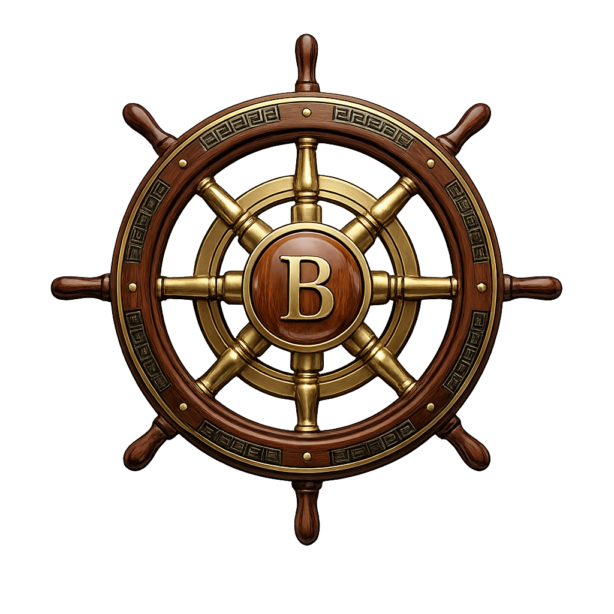

<p align="center">
  
</p>

<h1 align="center">Baeus</h1>

<p align="center">
  A native Kubernetes cluster management UI for macOS, built with Rust and GPUI.
</p>

<p align="center">
  <a href="https://github.com/Craigeous/baeus/releases">Download</a> &middot;
  <a href="#features">Features</a> &middot;
  <a href="#building-from-source">Build</a>
</p>

---

Baeus is a GPU-accelerated desktop application for browsing, inspecting, and managing Kubernetes clusters. It connects directly to your kubeconfig, provides rich resource visualization, and runs entirely on your machine with no server component.

## Features

**Multi-Cluster Navigation**
- Auto-discovers clusters from `~/.kube/` and custom scan directories
- Tab-based interface with cluster-scoped labels (e.g. "prod - Pods")
- Right-click context menu for connect/disconnect, settings, and removal

**Resource Browsing**
- 45+ resource types across 11 categories: Workloads, Network, Configuration, Storage, RBAC, Helm, ArgoCD, Monitoring, and more
- Sortable, filterable tables with per-kind columns
- Click any row to open a detail view with properties, labels, annotations, and conditions

**Topology Visualization**
- Cluster-level topology showing resource kinds as graph nodes with count badges and relationship edges
- Per-resource topology showing instance-level relationships (Pod &rarr; Service, Deployment &rarr; ReplicaSet &rarr; Pod, etc.)
- Interactive zoom, pan, and click-to-select

**Helm Integration**
- Browse deployed Helm releases with chart info, version, status, and revision history
- Install charts from the UI
- Automatic release manifest decoding (base64/gzip)

**Built-in Terminal & Logs**
- Embedded terminal emulator (alacritty) in a collapsible dock panel
- Real-time pod log streaming with configurable line limits
- Port-forward management

**YAML Editor**
- Tree-sitter syntax highlighting
- Edit and apply resources directly from the detail view
- Optimistic concurrency via resourceVersion

**Extensibility**
- Plugin system with sandboxed permissions (read, write, views, actions, network)
- CRD browser for custom resource types
- ArgoCD Application/ApplicationSet/AppProject support built-in

## Architecture

8-crate Rust workspace:

| Crate | Purpose |
|-------|---------|
| `baeus-app` | Entry point, settings, macOS .app bundling |
| `baeus-core` | K8s client (kube-rs), resource store, auth, metrics, logs, exec |
| `baeus-ui` | GPUI-based UI: app shell, navigator, tables, detail views, topology |
| `baeus-helm` | Helm release decoding and chart operations |
| `baeus-terminal` | Embedded terminal (alacritty_terminal + portable-pty) |
| `baeus-editor` | YAML editor (ropey + tree-sitter) |
| `baeus-plugins` | Plugin loading (libloading) with sandbox isolation |
| `baeus-test-utils` | Shared test helpers and fixtures |

GPUI owns the main thread for GPU-accelerated rendering. Kubernetes API calls run on a background Tokio runtime, keeping the UI responsive.

## Installation

Download the latest DMG from [Releases](https://github.com/Craigeous/baeus/releases), open it, and drag Baeus to Applications.

Since the app is not yet code-signed, you need to remove the quarantine attribute before launching:

```bash
xattr -cr /Applications/Baeus.app
```

**Requirements:** macOS 13.0+ (Apple Silicon)

## Building from Source

```bash
# Prerequisites: Rust 1.85+
curl --proto '=https' --tlsv1.2 -sSf https://sh.rustup.rs | sh

# Build
cargo build --workspace

# Run tests
RUST_MIN_STACK=268435456 cargo test --workspace

# Lint
cargo clippy --workspace

# Build macOS .app bundle + DMG
./macos/build-app.sh
```

## Keyboard Shortcuts

| Shortcut | Action |
|----------|--------|
| <kbd>Cmd</kbd>+<kbd>K</kbd> | Command palette |
| <kbd>Cmd</kbd>+<kbd>1</kbd>&ndash;<kbd>7</kbd> | Quick navigate (Dashboard, Clusters, Pods, Deployments, Services, Events, Helm) |
| <kbd>Cmd</kbd>+<kbd>B</kbd> | Toggle sidebar |
| <kbd>Cmd</kbd>+<kbd>W</kbd> | Close tab |
| <kbd>Cmd</kbd>+<kbd>R</kbd> | Refresh |
| <kbd>Cmd</kbd>+<kbd>F</kbd> | Focus search |
| <kbd>Ctrl</kbd>+<kbd>Tab</kbd> | Next tab |
| <kbd>Ctrl</kbd>+<kbd>Shift</kbd>+<kbd>Tab</kbd> | Previous tab |

## Security

- Kubernetes credentials are never logged (custom `Debug` impl redacts tokens, certs, and keys)
- Secret `.data` and `.stringData` values are redacted in the YAML editor
- Kubeconfig scan directories are restricted to the user's home directory
- Plugin loading is sandboxed with path traversal prevention and can be disabled entirely
- Preferences files are written with `0600` permissions
- Terminal shell paths are validated against an allowlist
- TLS is enforced via kube-rs defaults with no insecure fallbacks

## License

[MIT](Cargo.toml)
